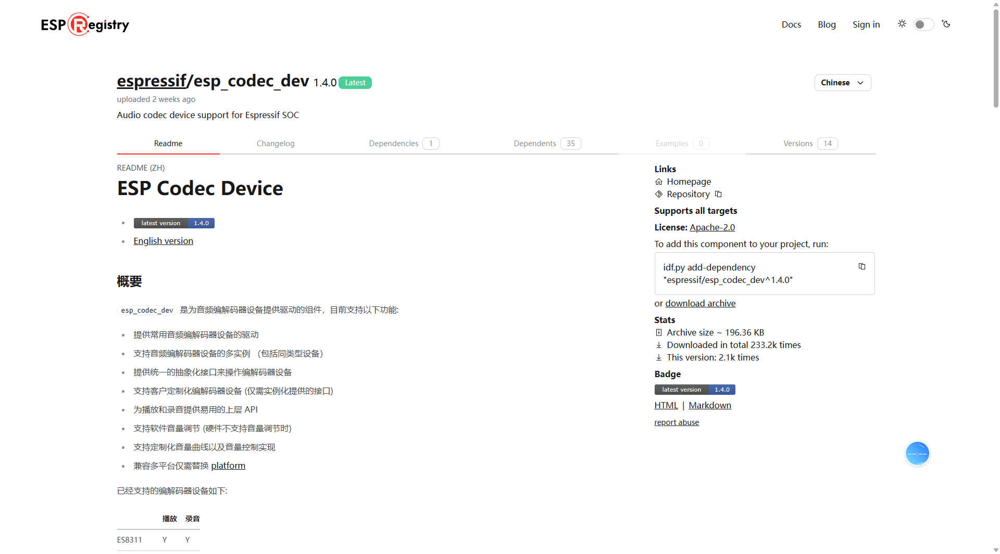
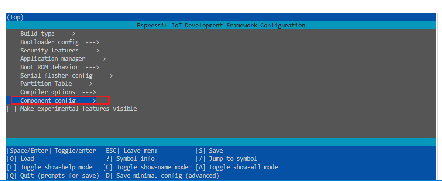
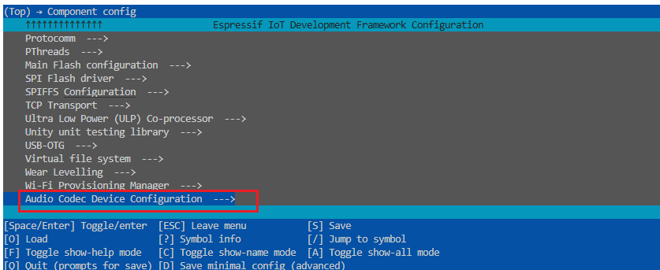
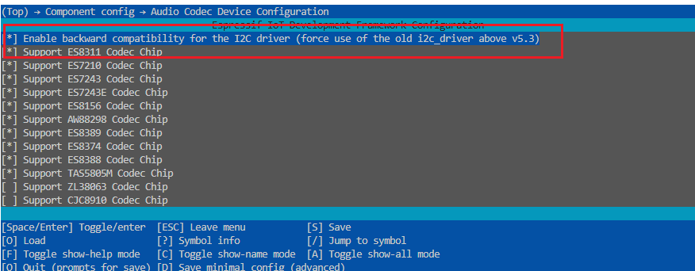

# ES8311

#  组件安装
## 搜索组件

 [ESP Component Registry](https://components.espressif.com/) 



## 下载组件
在终端执行这个命令,并重新编译

```c
idf.py add-dependency "espressif/esp_codec_dev^1.3.4"
```

## 使用组件
重新编译即可

# 驱动实现
## Int_ES8311.h
```c
#ifndef __INT_ES8311_H__
#define __INT_ES8311_H__

#include "driver/i2s_std.h"
#include "driver/i2s_tdm.h"
#include "soc/soc_caps.h"

#include "esp_codec_dev.h"
#include "esp_codec_dev_defaults.h"
#include "unity.h"

#include "driver/i2c.h"
#include "driver/gpio.h"
#include "Com_Debug.h"

#define ES8311_I2C_SDA_PIN GPIO_NUM_0 
#define ES8311_I2C_SCL_PIN GPIO_NUM_1

#define ES8311_I2S_BCK_PIN GPIO_NUM_2 
#define ES8311_I2S_MCK_PIN GPIO_NUM_3
#define ES8311_I2S_DI_PIN GPIO_NUM_4
#define ES8311_I2S_WS_PIN GPIO_NUM_5
#define ES8311_I2S_DO_PIN GPIO_NUM_6

#define ES8311_PA_EN_PIN GPIO_NUM_7

/**
 * @brief es8311 编解码器初始化
 * 
 */
void Int_ES8311_Init(void);

/**
 * @brief 从麦克风读取数据
 * 
 * @param data 读取到的数据
 * @param len 要读取的数据长度
 */
void Int_ES8311_ReadFromMic(void *data,int len);

/**
 * @brief 写入到功放
 * 
 * @param data 写入的数据
 */
void Int_ES8311_WriteToSpeak(void *data,int len);

/**
 * @brief 设置音量大小
 * 
 * @param Volume 要设置的音量
 */
void Int_ES8311_SetVolume(int Volume);

/**
 * @brief 设置静音
 * 
 * @param Mute true:静音  false:取消静音
 */
void Int_ES8311_SetMute(bool Mute);

#endif /* __INT_ES8311_H__ */
```

## Int_ES8311.c
```c
#include "Int_ES8311.h"

// I2S输入输出通道声明
i2s_chan_handle_t speaker_tx_handle;
i2s_chan_handle_t mic_rx_handle;

// ES8311设备对象声明
esp_codec_dev_handle_t codec_dev;

/**
 * @brief 初始化 I2C
 *
 */
static void Int_ES8311_I2C_Init(void)
{
    // 配置 I2C 对象
    i2c_config_t i2c_cfg = {
        .mode = I2C_MODE_MASTER,
        .sda_pullup_en = GPIO_PULLUP_ENABLE,
        .scl_pullup_en = GPIO_PULLUP_ENABLE,
        .master.clk_speed = 100000,
    };
    i2c_cfg.sda_io_num = ES8311_I2C_SDA_PIN;
    i2c_cfg.scl_io_num = ES8311_I2C_SCL_PIN;
    // 使配置生效
    i2c_param_config(I2C_NUM_0, &i2c_cfg);
    // 安装 I2C 驱动
    i2c_driver_install(I2C_NUM_0, i2c_cfg.mode, 0, 0, 0);
}

/**
 * @brief 初始化 I2S
 *
 */
static void Int_ES8311_I2S_Init(void)
{
    // I2S默认参数配置
    i2s_chan_config_t chan_cfg = I2S_CHANNEL_DEFAULT_CONFIG(I2S_NUM_0, I2S_ROLE_MASTER);
    // 音频标准格式/原始格式(PCM)配置信息
    i2s_std_config_t std_cfg = {
        .clk_cfg = I2S_STD_CLK_DEFAULT_CONFIG(16000),
        .slot_cfg = I2S_STD_PHILIPS_SLOT_DEFAULT_CONFIG(16, I2S_SLOT_MODE_MONO),
        .gpio_cfg = {
            .mclk = ES8311_I2S_MCK_PIN,
            .bclk = ES8311_I2S_BCK_PIN,
            .ws = ES8311_I2S_WS_PIN,
            .dout = ES8311_I2S_DO_PIN,
            .din = ES8311_I2S_DI_PIN,
        },
    };

    // 创建接收与发送通道
    i2s_new_channel(&chan_cfg, &speaker_tx_handle, &mic_rx_handle);

    // 初始化接收与发送通道
    i2s_channel_init_std_mode(speaker_tx_handle, &std_cfg);
    i2s_channel_init_std_mode(mic_rx_handle, &std_cfg);

    // 使能接收与发送通道
    i2s_channel_enable(speaker_tx_handle);
    i2s_channel_enable(mic_rx_handle);
}

/**
 * @brief 初始化 设备
 *
 */
static void Int_ES8311_DEV_Init(void)
{
    // Create the control and data interfaces for the codec using the interface provided by default
    // I2S通道配置
    audio_codec_i2s_cfg_t i2s_cfg = {
        .rx_handle = mic_rx_handle,
        .tx_handle = speaker_tx_handle,
    };
    // 使用I2S配置创建数据接口
    const audio_codec_data_if_t *data_if = audio_codec_new_i2s_data(&i2s_cfg);

    // I2C配置信息
    audio_codec_i2c_cfg_t i2c_cfg = {
        .addr = ES8311_CODEC_DEFAULT_ADDR,
        // .bus_handle,  // 新I2C需要配置的
        .port = I2C_NUM_0,
    };
    // 使用I2C配置创建输出控制接口
    const audio_codec_ctrl_if_t *out_ctrl_if = audio_codec_new_i2c_ctrl(&i2c_cfg);

    // 创建GPIO接口
    const audio_codec_gpio_if_t *gpio_if = audio_codec_new_gpio();

    // Create the codec interface based on control interface and codec-specified configuration
    // 创建ES8311编解码器配置
    es8311_codec_cfg_t es8311_cfg = {
        .codec_mode = ESP_CODEC_DEV_WORK_MODE_BOTH,
        .ctrl_if = out_ctrl_if,
        .gpio_if = gpio_if,
        .pa_pin = ES8311_PA_EN_PIN,
        .use_mclk = true,
    };
    // 创建编解码器接口
    const audio_codec_if_t *out_codec_if = es8311_codec_new(&es8311_cfg);

    // Get esp_codec_dev_handle_t through esp_codec_dev_new
    // Now you can use the handle for further playback and recording as follows:
    // 设备配置信息
    esp_codec_dev_cfg_t dev_cfg = {
        .codec_if = out_codec_if,              // codec interface from es8311_codec_new
        .data_if = data_if,                    // data interface from audio_codec_new_i2s_data
        .dev_type = ESP_CODEC_DEV_TYPE_IN_OUT, // codec support both playback and record
    };
    // 创建ES8311设备操作对象
    codec_dev = esp_codec_dev_new(&dev_cfg);
    // 设置输出音量
    esp_codec_dev_set_out_vol(codec_dev, 60.0);
    // 设置输入增益
    esp_codec_dev_set_in_gain(codec_dev, 20.0);
    // 采样参数
    esp_codec_dev_sample_info_t fs = {
        .sample_rate = 16000,                               // 采样率：16000Hz（与 I2S_STD_CLK_DEFAULT_CONFIG 一致）
        .channel = 1,                                       // 通道数：1（单声道，与 I2S_SLOT_MODE_MONO 一致）
        .channel_mask = ESP_CODEC_DEV_MAKE_CHANNEL_MASK(0), // 通道掩码：选择第 0 通道（单声道默认）
        .bits_per_sample = 16,                              // 采样位宽：16bit（与 I2S_STD_PHILIPS_SLOT 一致）
        .mclk_multiple = 256,                               // MCLK 倍频系数：256×采样率（ES8311 推荐配置，确保时钟稳定）
    };
    // 开启设备
    esp_codec_dev_open(codec_dev, &fs);
}

/**
 * @brief es8311 编解码器初始化
 *
 */
void Int_ES8311_Init(void)
{
    // 初始化 I2C
    Int_ES8311_I2C_Init();

    // 初始化 I2S
    Int_ES8311_I2S_Init();

    // 初始化 设备
    Int_ES8311_DEV_Init();
}

/**
 * @brief 从麦克风读取数据
 *
 * @param data 读取到的数据
 * @param len 要读取的数据长度
 */
void Int_ES8311_ReadFromMic(void *data, int len)
{
    if (codec_dev != NULL && len > 0)
    {
        esp_codec_dev_read(codec_dev, data, len);
    }
}

/**
 * @brief 写入到功放
 *
 * @param data 写入的数据
 */
void Int_ES8311_WriteToSpeak(void *data, int len)
{
    if (codec_dev != NULL && len > 0)
    {
        esp_codec_dev_write(codec_dev, data, len);
    }
}

/**
 * @brief 设置音量大小
 *
 * @param Volume 要设置的音量
 */
void Int_ES8311_SetVolume(int Volume)
{
    MY_LOGE("SetVolume: %d", Volume);
    // 设置输出音量
    esp_codec_dev_set_out_vol(codec_dev, Volume);
}

/**
 * @brief 设置静音
 *
 * @param Mute true:静音  false:取消静音
 */
void Int_ES8311_SetMute(bool Mute)
{
    MY_LOGE("设置静音状态为 %d", Mute);
    // 设置编解码器输出静音参数
    esp_codec_dev_set_out_mute(codec_dev,Mute);
}
```


## main中测试
```c
#include <stdio.h>
#include "Int/Int_ES8311.h"

void app_main(void)
{
    // 1. 初始化ES8311
    Int_ES8311_Init();

    // 2. 不断的从Mic中读取数据,然后直接交给扬声器播放
    uint8_t data[1024] = {0};

    while (1)
    {
        Int_ES8311_ReadFromMic(data, 1024);
        Int_ES8311_WriteToSpeak(data, 1024);

        vTaskDelay(10);
    }
}

```

## 使用旧版本I2C的组件
**方法一:**

1. 检查`menuconfig`配置

```c
idf.py menuconfig
```

2. 选择



3. 选择



4. 选择



**方法二:**

使用需要 SDK配置 中勾选


