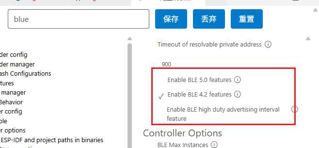
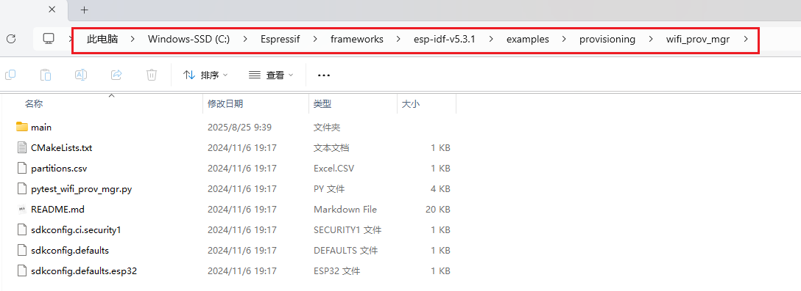
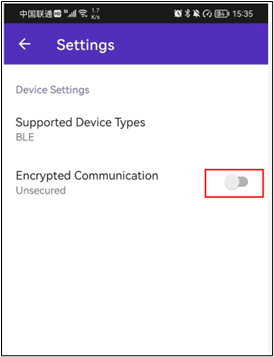

# 配网方式
esp提供了2种配网方式:

（1）Wi-Fi（SoftAP + HTTP 服务器）

就是先在esp中开启wifi热点, 并启动一个http服务器. 手机wifi连接这个热点, 然后访问http服务器提供的配网页面, 在页面中选择esp将来要连接的wifi ap, 并填写密码. 然后重启esp, esp就会连接刚刚配置的WiFi了

（2）**低功耗蓝牙（基于 GATT）传输方式。**

就是通过蓝牙把相应的wifi信息传输给esp32

**<font style="color:red;">选择使用低功耗蓝牙配网</font>**

## 下载esp专用的手机配网app
下载地址: 

Android:

[https://github.com/espressif/esp-idf-provisioning-android/releases/download/Provisioning_App_Release_2.2.0/ESP_BLE_Prov_2_2_0.apk](https://github.com/espressif/esp-idf-provisioning-android/releases/download/Provisioning_App_Release_2.2.0/ESP_BLE_Prov_2_2_0.apk)

IOS: 

[https://apps.apple.com/in/app/esp-ble-provisioning/id1473590141](https://apps.apple.com/in/app/esp-ble-provisioning/id1473590141)

# 用户配置





建议勾选不然后期空间可能不足


# 示例代码




# 安装组件


# 代码
## Dri_WIFI.c
```c
#include "Dri_WIFI.h"

static const char *TAG = "dri_wifi";

/* 在这个事件组上信号Wi-Fi事件 */
const int WIFI_CONNECTED_EVENT = BIT0;
static EventGroupHandle_t wifi_event_group;

#define PROV_QR_VERSION "v1"
#define PROV_TRANSPORT_SOFTAP "softap"
#define PROV_TRANSPORT_BLE "ble"
#define QRCODE_BASE_URL "https://espressif.github.io/esp-jumpstart/qrcode.html"

/* 用于捕获系统事件的事件处理程序 */
static void event_handler(void *arg, esp_event_base_t event_base,
                          int32_t event_id, void *event_data)
{
    // 定义重连次数
    static int wifi_connect_retries;

    if (event_base == WIFI_PROV_EVENT)
    {
        switch (event_id)
        {
        case WIFI_PROV_START:
            ESP_LOGI(TAG, "Provisioning started");
            break;
        case WIFI_PROV_CRED_RECV:
        {
            wifi_sta_config_t *wifi_sta_cfg = (wifi_sta_config_t *)event_data;
            ESP_LOGI(TAG, "Received Wi-Fi credentials"
                          "\n\tSSID     : %s\n\tPassword : %s",
                     (const char *)wifi_sta_cfg->ssid,
                     (const char *)wifi_sta_cfg->password);
            break;
        }
        case WIFI_PROV_CRED_FAIL:
        {
            wifi_prov_sta_fail_reason_t *reason = (wifi_prov_sta_fail_reason_t *)event_data;
            ESP_LOGE(TAG, "Provisioning failed!\n\tReason : %s"
                          "\n\tPlease reset to factory and retry provisioning",
                     (*reason == WIFI_PROV_STA_AUTH_ERROR) ? "Wi-Fi station authentication failed" : "Wi-Fi access-point not found");
            break;
        }
        case WIFI_PROV_CRED_SUCCESS:
            ESP_LOGI(TAG, "Provisioning successful");
            break;
        case WIFI_PROV_END:
            /* De-initialize manager once provisioning is finished */
            wifi_prov_mgr_deinit();
            break;
        default:
            break;
        }
    }
    else if (event_base == WIFI_EVENT)
    {
        switch (event_id)
        {
        case WIFI_EVENT_STA_START:
            esp_wifi_connect();
            break;
        case WIFI_EVENT_STA_DISCONNECTED:
            ESP_LOGI(TAG, "Disconnected. Connecting to the AP again...");
            wifi_connect_retries++;
            if (wifi_connect_retries > 10)
            {
                // 删除配置信息重新连接
                wifi_prov_mgr_reset_provisioning();
                esp_restart();
            }

            esp_wifi_connect();
            break;
        default:
            break;
        }
    }
    else if (event_base == IP_EVENT && event_id == IP_EVENT_STA_GOT_IP)
    {
        ip_event_got_ip_t *event = (ip_event_got_ip_t *)event_data;
        ESP_LOGI(TAG, "Connected with IP Address:" IPSTR, IP2STR(&event->ip_info.ip));
        // 清空连接计数
        wifi_connect_retries = 0;
        /* 信号主应用程序继续执行 */
        xEventGroupSetBits(wifi_event_group, WIFI_CONNECTED_EVENT);
    }
    else if (event_base == PROTOCOMM_TRANSPORT_BLE_EVENT)
    {
        switch (event_id)
        {
        case PROTOCOMM_TRANSPORT_BLE_CONNECTED:
            ESP_LOGI(TAG, "BLE transport: Connected!");
            break;
        case PROTOCOMM_TRANSPORT_BLE_DISCONNECTED:
            ESP_LOGI(TAG, "BLE transport: Disconnected!");
            break;
        default:
            break;
        }
    }
    else if (event_base == PROTOCOMM_SECURITY_SESSION_EVENT)
    {
        switch (event_id)
        {
        case PROTOCOMM_SECURITY_SESSION_SETUP_OK:
            ESP_LOGI(TAG, "Secured session established!");
            break;
        case PROTOCOMM_SECURITY_SESSION_INVALID_SECURITY_PARAMS:
            ESP_LOGE(TAG, "Received invalid security parameters for establishing secure session!");
            break;
        case PROTOCOMM_SECURITY_SESSION_CREDENTIALS_MISMATCH:
            ESP_LOGE(TAG, "Received incorrect username and/or PoP for establishing secure session!");
            break;
        default:
            break;
        }
    }
}

static void wifi_init_sta(void)
{
    /* Start Wi-Fi in station mode */
    ESP_ERROR_CHECK(esp_wifi_set_mode(WIFI_MODE_STA));
    ESP_ERROR_CHECK(esp_wifi_start());
}

static void get_device_service_name(char *service_name, size_t max)
{
    uint8_t eth_mac[6];
    const char *ssid_prefix = "PROV_";
    esp_wifi_get_mac(WIFI_IF_STA, eth_mac);
    snprintf(service_name, max, "%s%02X%02X%02X",
             ssid_prefix, eth_mac[3], eth_mac[4], eth_mac[5]);
}

/* Handler for the optional provisioning endpoint registered by the application.
 * The data format can be chosen by applications. Here, we are using plain ascii text.
 * Applications can choose to use other formats like protobuf, JSON, XML, etc.
 * Note that memory for the response buffer must be allocated using heap as this buffer
 * gets freed by the protocomm layer once it has been sent by the transport layer.
 */
esp_err_t custom_prov_data_handler(uint32_t session_id, const uint8_t *inbuf, ssize_t inlen,
                                   uint8_t **outbuf, ssize_t *outlen, void *priv_data)
{
    if (inbuf)
    {
        ESP_LOGI(TAG, "Received data: %.*s", inlen, (char *)inbuf);
    }
    char response[] = "SUCCESS";
    *outbuf = (uint8_t *)strdup(response);
    if (*outbuf == NULL)
    {
        ESP_LOGE(TAG, "System out of memory");
        return ESP_ERR_NO_MEM;
    }
    *outlen = strlen(response) + 1; /* +1 for NULL terminating byte */

    return ESP_OK;
}

static void wifi_prov_print_qr(const char *name, const char *username, const char *pop, const char *transport)
{
    if (!name || !transport)
    {
        ESP_LOGW(TAG, "Cannot generate QR code payload. Data missing.");
        return;
    }
    char payload[150] = {0};

    snprintf(payload, sizeof(payload), "{\"ver\":\"%s\",\"name\":\"%s\""
                                       ",\"transport\":\"%s\"}",
             PROV_QR_VERSION, name, transport);

    // 配置 WiFi二维码
    ESP_LOGI(TAG, "Scan this QR code from the provisioning application for Provisioning.");
    esp_qrcode_config_t cfg = ESP_QRCODE_CONFIG_DEFAULT();
    esp_qrcode_generate(&cfg, payload);

    ESP_LOGI(TAG, "If QR code is not visible, copy paste the below URL in a browser.\n%s?data=%s", QRCODE_BASE_URL, payload);
}

/**
 * @brief 初始化 WIFI
 *
 * @note 使用蓝牙配网
 */
void Dri_WIFI_Init(void)
{
    /* 初始化 NVS */
    esp_err_t ret = nvs_flash_init();
    if (ret == ESP_ERR_NVS_NO_FREE_PAGES || ret == ESP_ERR_NVS_NEW_VERSION_FOUND)
    {
        /* NVS partition was truncated
         * and needs to be erased */
        ESP_ERROR_CHECK(nvs_flash_erase());
        /* Retry nvs_flash_init */
        ESP_ERROR_CHECK(nvs_flash_init());
    }

    /* Initialize TCP/IP */
    ESP_ERROR_CHECK(esp_netif_init());

    /* Initialize the event loop */
    ESP_ERROR_CHECK(esp_event_loop_create_default());
    wifi_event_group = xEventGroupCreate();

    /* 注册我们的事件处理程序以处理Wi-Fi、IP和配置相关事件 */
    ESP_ERROR_CHECK(esp_event_handler_register(WIFI_PROV_EVENT, ESP_EVENT_ANY_ID, &event_handler, NULL));
    ESP_ERROR_CHECK(esp_event_handler_register(PROTOCOMM_TRANSPORT_BLE_EVENT, ESP_EVENT_ANY_ID, &event_handler, NULL));
    ESP_ERROR_CHECK(esp_event_handler_register(PROTOCOMM_SECURITY_SESSION_EVENT, ESP_EVENT_ANY_ID, &event_handler, NULL));
    ESP_ERROR_CHECK(esp_event_handler_register(WIFI_EVENT, ESP_EVENT_ANY_ID, &event_handler, NULL));
    ESP_ERROR_CHECK(esp_event_handler_register(IP_EVENT, IP_EVENT_STA_GOT_IP, &event_handler, NULL));

    /* 初始化Wi-Fi，包括使用默认配置的网络接口 */
    esp_netif_create_default_wifi_sta();

    wifi_init_config_t cfg = WIFI_INIT_CONFIG_DEFAULT();
    ESP_ERROR_CHECK(esp_wifi_init(&cfg));

    /* 配置管理 */
    wifi_prov_mgr_config_t config = {
        .scheme = wifi_prov_scheme_ble,
        .scheme_event_handler = WIFI_PROV_SCHEME_BLE_EVENT_HANDLER_FREE_BTDM};

    /* 使用上述配置参数初始化配置管理器 */
    ESP_ERROR_CHECK(wifi_prov_mgr_init(config));

    bool provisioned = false;
    /* 让我们看看设备是否已配置 */
    ESP_ERROR_CHECK(wifi_prov_mgr_is_provisioned(&provisioned));

    /* 如果设备尚未配置，请启动配置服务 */
    if (!provisioned)
    {
        ESP_LOGI(TAG, "Starting provisioning");

        /* What is the Device Service Name that we want
         * This translates to :
         *     - Wi-Fi SSID when scheme is wifi_prov_scheme_softap
         *     - device name when scheme is wifi_prov_scheme_ble
         */
        char service_name[12];
        get_device_service_name(service_name, sizeof(service_name));

        /* What is the service key (could be NULL)
         * This translates to :
         *     - Wi-Fi password when scheme is wifi_prov_scheme_softap
         *          (Minimum expected length: 8, maximum 64 for WPA2-PSK)
         *     - simply ignored when scheme is wifi_prov_scheme_ble
         */
        const char *service_key = NULL;

        /* This step is only useful when scheme is wifi_prov_scheme_ble. This will
         * set a custom 128 bit UUID which will be included in the BLE advertisement
         * and will correspond to the primary GATT service that provides provisioning
         * endpoints as GATT characteristics. Each GATT characteristic will be
         * formed using the primary service UUID as base, with different auto assigned
         * 12th and 13th bytes (assume counting starts from 0th byte). The client side
         * applications must identify the endpoints by reading the User Characteristic
         * Description descriptor (0x2901) for each characteristic, which contains the
         * endpoint name of the characteristic */
        uint8_t custom_service_uuid[] = {
            /* LSB <---------------------------------------
             * ---------------------------------------> MSB */
            0xb4,
            0xdf,
            0x5a,
            0x1c,
            0x3f,
            0x6b,
            0xf4,
            0xbf,
            0xea,
            0x4a,
            0x82,
            0x03,
            0x04,
            0x90,
            0x1a,
            0x02,
        };

        /* If your build fails with linker errors at this point, then you may have
         * forgotten to enable the BT stack or BTDM BLE settings in the SDK (e.g. see
         * the sdkconfig.defaults in the example project) */
        wifi_prov_scheme_ble_set_service_uuid(custom_service_uuid);

        /* An optional endpoint that applications can create if they expect to
         * get some additional custom data during provisioning workflow.
         * The endpoint name can be anything of your choice.
         * This call must be made before starting the provisioning.
         */
        wifi_prov_mgr_endpoint_create("custom-data");

        /* // 开始配网 */
        wifi_prov_security_t security = WIFI_PROV_SECURITY_0;
        ESP_ERROR_CHECK(wifi_prov_mgr_start_provisioning(security, (const void *)NULL, service_name, service_key));

        /* The handler for the optional endpoint created above.
         * This call must be made after starting the provisioning, and only if the endpoint
         * has already been created above.
         */
        // 注册节点
        wifi_prov_mgr_endpoint_register("custom-data", custom_prov_data_handler, NULL);

        // 打印二维码
        wifi_prov_print_qr(service_name, NULL, NULL, PROV_TRANSPORT_BLE);
    }
    else
    {
        ESP_LOGI(TAG, "Already provisioned, starting Wi-Fi STA");

        /* We don't need the manager as device is already provisioned,
         * so let's release it's resources */
        wifi_prov_mgr_deinit();

        /* Start Wi-Fi station */
        wifi_init_sta();
    }

    /* Wait for Wi-Fi connection */
    xEventGroupWaitBits(wifi_event_group, WIFI_CONNECTED_EVENT, true, true, portMAX_DELAY);
}
```


## Dri_WIFI.h
```c
#ifndef __DRI_WIFI_H__
#define __DRI_WIFI_H__

#include "Com_Debug.h"
#include <stdio.h>
#include <string.h>

#include <freertos/FreeRTOS.h>
#include <freertos/task.h>
#include <freertos/event_groups.h>

#include <esp_log.h>
#include <esp_wifi.h>
#include <esp_event.h>
#include <nvs_flash.h>

#include <wifi_provisioning/manager.h>
#include <wifi_provisioning/scheme_ble.h>

#include "qrcode.h" // 用来生成二维码

/**
 * @brief 初始化 WIFI
 * 
 * @note 使用蓝牙配网
 */
void Dri_WIFI_Init(void);

#endif /* __DRI_WIFI_H__ */
```

# 下载软件
下载地址: 

Android:

[https://github.com/espressif/esp-idf-provisioning-android/releases/download/Provisioning_App_Release_2.2.0/ESP_BLE_Prov_2_2_0.apk](https://github.com/espressif/esp-idf-provisioning-android/releases/download/Provisioning_App_Release_2.2.0/ESP_BLE_Prov_2_2_0.apk)

IOS: 

[https://apps.apple.com/in/app/esp-ble-provisioning/id1473590141](https://apps.apple.com/in/app/esp-ble-provisioning/id1473590141)


# 使用手机app进行配网
程序启动后, 会在控制台打印二维码, 每台设备的二维码是唯一的


打开手机app, 关掉安全通信(我们在代码中设置的安全级别为0)



然后扫描二维码, 输入要连接的wifi和密码, 就可以配网成功了.  Wifi名和密码会存在nvs中,以后就会自动读取了


