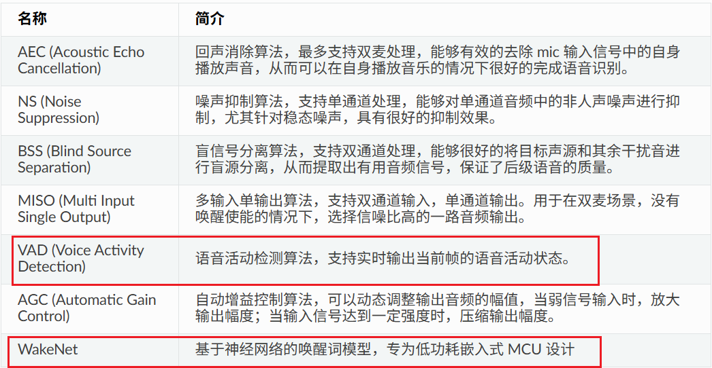
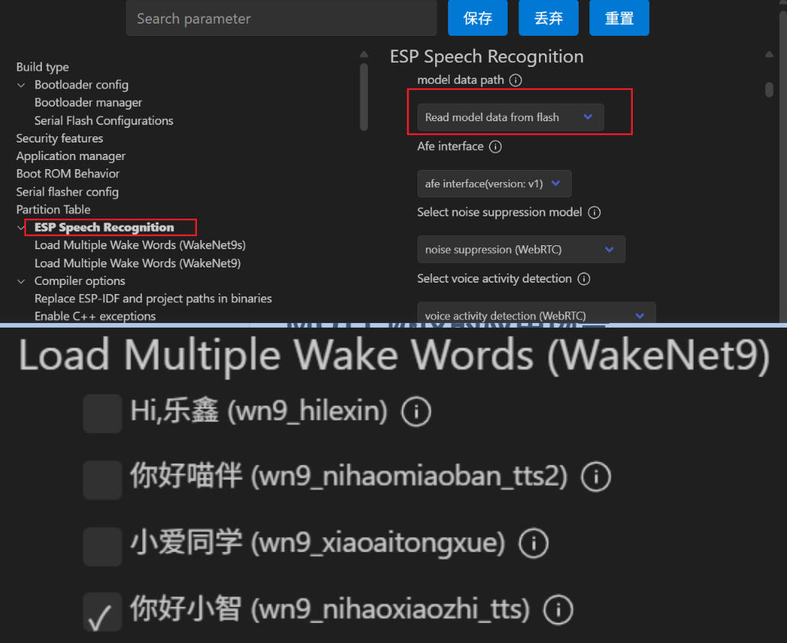

# SR音频识别模块

# AFE声学前端
## AFE声学前端介绍

 智能语音设备需要在远场噪声环境中，仍具备出色的语音交互性能，声学前端 (Audio Front-End, AFE) 算法在构建此类语音用户界面 (Voice-User Interface, VUI) 时至关重要。乐鑫 AI 实验室自主研发了一套乐鑫 AFE 算法框架，可基于功能强大的 ESP32-S3 系列芯片进行声学前端处理，使用户获得高质量且稳定的音频数据，从而构建性能卓越且高性价比的智能语音产品。 

 [AFE 声学前端 - ESP32-S3 - — ESP-SR latest 文档](https://docs.espressif.com/projects/esp-sr/zh_CN/latest/esp32s3/audio_front_end/index.html) 



**WakeNet**用作小智的唤醒,**VAD**用作人声的检测.

##  AFE声学前端的组件下载

 官方文档:

[espressif/esp-sr • v2.1.5 • ESP Component Registry](https://components.espressif.com/components/espressif/esp-sr/versions/2.1.5/readme) 

```c
idf.py add-dependency "espressif/esp-sr^2.1.5"
```

使用参考:

 [AFE 声学前端算法框架 - ESP32-S3 - — ESP-SR latest 文档](https://docs.espressif.com/projects/esp-sr/zh_CN/latest/esp32s3/audio_front_end/README.html) 

## SDK配置修改

更改模型存放位置为PSRAM和设置唤醒语音



修改 partition.csv


# SR代码
## Int_SR.c
```c
#include "Int_SR.h"

// 语音识别对象
struct audio_sr
{
    esp_afe_sr_iface_t *afe_handle; // AFE实例句柄
    esp_afe_sr_data_t *afe_data;    // AFE实例

    bool is_wakeup; // 是否唤醒标志

    vad_state_t last_vad_state; // 上次人声状态

    RingbufHandle_t ringbufferhandle; // 环形缓冲区句柄

    void *wakenet_args;                            // 唤醒回调函数的参数
    void (*wakenet_cb)(void *);                    // 唤醒回调函数
    void *vad_args;                                // 人声识别回调函数的参数
    void (*vad_cb)(vad_state_t vad_state, void *); // 人声识别的回调函数
};

// 声明任务函数: 处理AFE声学前端的输出结果
static void audio_sr_fetch_task(void *args);
// 声明任务函数: 把来自mic的数据写入到AFE声学前端
static void audio_sr_feed_task(void *args);

/**
 * @brief 创建 语音识别系统
 *
 * @return audio_sr_t* 语音识别对象
 */
audio_sr_t *Int_SR_Creat(void)
{
    // 为语音识别对象申请资源
    audio_sr_t *audio_sr = (audio_sr_t *)heap_caps_malloc(sizeof(audio_sr_t), MALLOC_CAP_SPIRAM);

    // 初始化AFE配置
    srmodel_list_t *models = esp_srmodel_init("model");
    afe_config_t *afe_config = afe_config_init("M", models, AFE_TYPE_SR, AFE_MODE_HIGH_PERF);
    afe_config->aec_init = false;
    afe_config->se_init = false;
    afe_config->ns_init = false;
    afe_config->agc_init = false;

    afe_config->wakenet_init = true;
    afe_config->wakenet_mode = DET_MODE_95; // Aggressive
    afe_config->vad_init = true;
    afe_config->vad_mode = VAD_MODE_2; // Very Aggressive
    afe_config->memory_alloc_mode = AFE_MEMORY_ALLOC_MORE_PSRAM;

    // 创建AFE实例
    // 获取句柄
    audio_sr->afe_handle = esp_afe_handle_from_config(afe_config);
    // 创建实例
    audio_sr->afe_data = audio_sr->afe_handle->create_from_config(afe_config);

    // 返回音频对象
    return audio_sr;
}

/**
 * @brief 开启 语音识别系统
 *
 * @param audio_sr 语音识别对象
 * @note 创建两个任务 (把来自mic的数据写入到AFE声学前端) (处理AFE声学前端的输出结果)
 */
void Int_SR_Start(audio_sr_t *audio_sr)
{
    // 判断 audio_sr是否为空
    assert(audio_sr);
    // 为唤醒状态赋初值
    audio_sr->is_wakeup = false;
    // 为上次人声状态赋初值
    audio_sr->last_vad_state = VAD_SILENCE;

    // 创建任务 处理AFE声学前端的输出结果 (fetch:拿来,取得)
    xTaskCreateWithCaps(audio_sr_fetch_task, "audio_sr_fetch_task", 32 * 1024, audio_sr, 5, NULL, MALLOC_CAP_SPIRAM);
    // 创建任务 把来自mic的数据写入到AFE声学前端 (feed:喂养,提供)
    xTaskCreateWithCaps(audio_sr_feed_task, "audio_sr_feed_task", 32 * 1024, audio_sr, 5, NULL, MALLOC_CAP_SPIRAM);
}

/**
 * @brief 重置 语音识别系统的唤醒状态
 * 
 * @param audio_sr 语音识别对象
 */
void Int_SR_Reset_Wakenet(audio_sr_t *audio_sr)
{
    // 判断 audio_sr是否为空
    assert(audio_sr);
    // 重置唤醒状态
    audio_sr->is_wakeup = false;
    // 重置上次人声状态
    audio_sr->last_vad_state = VAD_SILENCE;
}

// 实现任务函数: 把来自mic的数据写入到AFE声学前端
static void audio_sr_feed_task(void *args)
{
    MY_LOGE("feed task is start...\r\n");
    audio_sr_t *audio_sr = args;
    esp_afe_sr_iface_t *afe_handle; // AFE实例句柄
    esp_afe_sr_data_t *afe_data;    // AFE实例
    afe_handle = audio_sr->afe_handle;
    afe_data = audio_sr->afe_data;

    // 将音频数据输入AFE进行处理 (feed_chunksize：每帧输入的样本数 ,eed_nch：输入数据的通道数 ,feed_buff：通道交错的音频数据)
    int feed_chunksize = afe_handle->get_feed_chunksize(afe_data);
    int feed_nch = afe_handle->get_feed_channel_num(afe_data);
    int feed_size = feed_chunksize * feed_nch * sizeof(int16_t);
    int16_t *feed_buff = (int16_t *)malloc(feed_size);

    while (1)
    {
        // 从mic读取数据
        Int_ES8311_ReadFromMic(feed_buff, feed_size);
        afe_handle->feed(afe_data, feed_buff);
        vTaskDelay(10);
    }
}

// 实现任务函数: 处理AFE声学前端的输出结果
static void audio_sr_fetch_task(void *args)
{
    MY_LOGE("fetch task is start...\r\n");
    audio_sr_t *audio_sr = args;
    esp_afe_sr_iface_t *afe_handle; // AFE实例句柄
    esp_afe_sr_data_t *afe_data;    // AFE实例
    afe_handle = audio_sr->afe_handle;
    afe_data = audio_sr->afe_data;

    // 将音频数据输入AFE进行处理 (feed_chunksize：每帧输入的样本数 ,eed_nch：输入数据的通道数 ,feed_buff：通道交错的音频数据)
    int feed_chunksize = afe_handle->get_feed_chunksize(afe_data);
    int feed_nch = afe_handle->get_feed_channel_num(afe_data);
    int feed_size = feed_chunksize * feed_nch * sizeof(int16_t);

    while (1)
    {
        // 获取处理后的单通道音频输出和检测状态
        afe_fetch_result_t *result = afe_handle->fetch(afe_data);
        if (result == NULL)
        { // 必须检查 NULL
            MY_LOGE("AFE fetch failed: result is NULL");
            vTaskDelay(10);
            continue;
        }
        wakenet_state_t wakeup_state = result->wakeup_state;
        vad_state_t vad_state = result->vad_state;

        // get the processed audio with specified delay, default delay is 2000 ms
        // afe_fetch_result_t *delayed_result  = afe_handle->fetch_with_delay(afe_data, 100 / portTICK_PERIOD_MS);

        // 检测到唤醒词
        if (wakeup_state == WAKENET_DETECTED)
        {
            audio_sr->is_wakeup = true;
            if (audio_sr->wakenet_cb != NULL)
            {
                // 调用唤醒回调函数
                audio_sr->wakenet_cb(audio_sr->wakenet_args);
            }
        }

        // 如果在唤醒状态下人声状态发生改变
        if (audio_sr->is_wakeup == true)
        {
            if (audio_sr->last_vad_state != vad_state)
            {
                // 更新上次人声状态
                audio_sr->last_vad_state = vad_state;
                if (audio_sr->vad_cb != NULL)
                {
                    // 调用识别人声回调函数
                    audio_sr->vad_cb(vad_state, audio_sr->vad_args);
                }
            }
        }

        // 如果当前为唤醒状态并且检测到人声,那么需要将音频数据保存至缓冲区
        if (vad_state == VAD_SPEECH && audio_sr->is_wakeup == true && Com_Status == Com_Status_LISTENING)
        {
            // 取出音频数据
            int16_t *data = result->raw_data;

            // 将数据写入环形缓冲区
            xRingbufferSend(audio_sr->ringbufferhandle, data, feed_size, portMAX_DELAY);
        }

        // vTaskDelay(10);
    }
}

/**
 * @brief 为语音识别系统添加输出缓冲区
 *
 * @param audio_sr 语音识别对象
 * @param ringbuffer 缓冲区对象
 */
void Int_SR_Set_OutputBuffer(audio_sr_t *audio_sr, RingbufHandle_t ringbufferhandle)
{
    // 判断 audio ringbufferhandle是否为空
    assert(audio_sr);
    assert(ringbufferhandle);

    // 添加到结构体对象中
    audio_sr->ringbufferhandle = ringbufferhandle;
}

/**
 * @brief 创建唤醒后的回调函数
 *
 * @param audio_sr 语音识别对象
 * @param wakenet_cb 唤醒后的回调函数
 * @param args 函数参数
 */
void Int_SR_Set_WakeNet_cb(audio_sr_t *audio_sr, void (*wakenet_cb)(void *), void *args)
{
    // 判断 audio_sr是否为空
    assert(audio_sr);

    // 添加到结构体对象中
    audio_sr->wakenet_cb = wakenet_cb;
    audio_sr->wakenet_args = args;
}

/**
 * @brief 创建人声识别的回调函数
 *
 * @param audio_sr 语音识别对象
 * @param vad_cb 人声识别的回调函数
 * @param args 函数参数
 */
void Int_SR_Set_VAD_cb(audio_sr_t *audio_sr, void (*vad_cb)(vad_state_t vad_state, void *), void *args)
{
    // 判断 audio_sr是否为空
    assert(audio_sr);

    // 添加到结构体对象中
    audio_sr->vad_cb = vad_cb;
    audio_sr->vad_args = args;
}
```


## Int_SR.h
```c
#ifndef __INT_SR_H__
#define __INT_SR_H__

#include "freertos/ringbuf.h"
#include "esp_afe_sr_iface.h"
#include "esp_afe_sr_models.h"

#include "assert.h"
#include "esp_heap_caps.h"
#include "Com_Debug.h"
#include "Int_ES8311.h"
#include "Com_status.h"

// 语音识别对象
typedef struct audio_sr audio_sr_t;

/**
 * @brief 创建 语音识别系统
 * 
 * @return audio_sr_t* 语音识别对象
 */
audio_sr_t *Int_SR_Creat(void);

/**
 * @brief 开启 语音识别系统
 *
 * @param audio_sr 语音识别对象
 * @note 创建两个任务 (把来自mic的数据写入到AFE声学前端) (处理AFE声学前端的输出结果)
 */
void Int_SR_Start(audio_sr_t *audio_sr);

/**
 * @brief 重置 语音识别系统的唤醒状态
 * 
 * @param audio_sr 语音识别对象
 */
void Int_SR_Reset_Wakenet(audio_sr_t *audio_sr);

/**
 * @brief 为语音识别系统添加输出缓冲区
 * 
 * @param audio_sr 语音识别对象
 * @param ringbuffer 缓冲区对象
 */
void Int_SR_Set_OutputBuffer(audio_sr_t *audio_sr, RingbufHandle_t ringbufferhandle);

/**
 * @brief 创建唤醒后的回调函数
 * 
 * @param audio_sr 语音识别对象
 * @param wakenet_cb 唤醒后的回调函数
 * @param args 函数参数
 */
void Int_SR_Set_WakeNet_cb(audio_sr_t *audio_sr, void (*wakenet_cb)(void *), void *args);

/**
 * @brief 创建人声识别的回调函数
 * 
 * @param audio_sr 语音识别对象
 * @param vad_cb 人声识别的回调函数
 * @param args 函数参数
 */
void Int_SR_Set_VAD_cb(audio_sr_t *audio_sr, void (*vad_cb)(vad_state_t vad_state, void *), void *args);

#endif /* __INT_SR_H__ */
```


