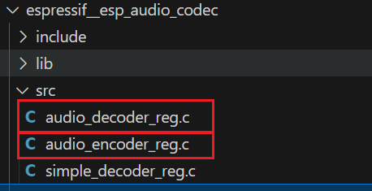

# pcm-opus编码器解码器模块

人发出的声音被麦克风(**MIC**)捕获后,经过**ES8311**处理之后的音频二进制数据是**PCM**格式数据,而,**服务器**大多可以解析的音频二进制数据是**OPUS**数据.

因此,把音频数据上传前需要**把PCM格式转换为OPUS数据.**

##  编解码器组件下载

 官方文档:

 [espressif/esp_audio_codec • v2.3.0 • ESP Component Registry](https://components.espressif.com/components/espressif/esp_audio_codec/versions/2.3.0/readme) 

```c
idf.py add-dependency "espressif/esp_audio_codec^2.3.0"
```



# 编码器代码
## Int_encoder.c
```c
#include "Int_encoder.h"

// opus编码器 将 PCM格式 --> OPUS格式
struct audio_encoder
{
    esp_audio_enc_handle_t encoder; // 编码器句柄

    RingbufHandle_t outputbufferhandle; // 输出缓冲区句柄
    RingbufHandle_t inputbufferhandle;  // 输入缓冲区句柄
};

// 任务声明: opus编码器工作任务 (PCM格式 --> OPUS格式)的任务
static void audio_encoder_task(void *args);

// opus编码器从输入缓冲区读取数据到pcm_data,每次都需要保证1920个字节 临时缓冲区（pcm_data），将多次读取的碎片化数据拼接成完整帧，再交给编码器处理
static void Int_encoder_ReadFromBuffer(RingbufHandle_t inputbufferhandle, uint8_t *pcm_data, int pcm_size)
{
    void *read_data = NULL;
    size_t read_size = 0;
    while (pcm_size > 0)
    {
        read_data = xRingbufferReceiveUpTo(inputbufferhandle, &read_size, portMAX_DELAY, pcm_size);
        memcpy(pcm_data,read_data,read_size);
        pcm_size -= read_size;
        pcm_data += read_size; 

        // 释放资源
        vRingbufferReturnItem(inputbufferhandle,read_data);
    }
}

/**
 * @brief 创建 opus编码器对象 并注册 opus编码器
 *
 * @return audio_encoder_t* opus编码器对象
 */
audio_encoder_t *Int_encoder_Creat(void)
{
    // 创建 opus编码器(PCM格式 --> OPUS格式)的任务
    audio_encoder_t *audio_encoder = (audio_encoder_t *)heap_caps_malloc(sizeof(audio_encoder_t), MALLOC_CAP_SPIRAM);
    if (audio_encoder)
    {
        audio_encoder->encoder = NULL; // 显式初始化
        audio_encoder->outputbufferhandle = NULL;
        audio_encoder->inputbufferhandle = NULL;
    }
    // 注册 opus编码器
    esp_opus_enc_register();
    // opus编码器的配置
    esp_opus_enc_config_t opus_cfg = {
        .sample_rate = ESP_AUDIO_SAMPLE_RATE_16K,
        .channel = ESP_AUDIO_MONO,
        .bits_per_sample = ESP_AUDIO_BIT16,
        .bitrate = 90000,
        .frame_duration = ESP_OPUS_ENC_FRAME_DURATION_60_MS,
        .application_mode = ESP_OPUS_ENC_APPLICATION_VOIP,
        .complexity = 5,
        .enable_fec = false,
        .enable_dtx = false,
        .enable_vbr = false,
    };
    esp_audio_enc_config_t enc_cfg = {
        .type = ESP_AUDIO_TYPE_OPUS,
        .cfg = &opus_cfg,
        .cfg_sz = sizeof(opus_cfg)};
    // 创建 opus编码器对象
    esp_audio_enc_open(&enc_cfg, &audio_encoder->encoder);

    // 返回编码器对象
    return audio_encoder;
}

/**
 * @brief opus编码器开始工作
 *
 * @param audio_encoder opus编码器对象
 * @note 创建任务函数
 */
void Int_encoder_Start(audio_encoder_t *audio_encoder)
{
    assert(audio_encoder);

    // 创建任务 opus编码器工作任务 (PCM格式 --> OPUS格式)的任务
    xTaskCreateWithCaps(audio_encoder_task, "audio_encoder_task", 32 * 1024, audio_encoder, 5, NULL, MALLOC_CAP_SPIRAM);
}

// 任务实现: opus编码器工作任务 (PCM格式 --> OPUS格式)的任务
static void audio_encoder_task(void *args)
{
    MY_LOGE("audio encoder task is start...\r\n");
    audio_encoder_t *audio_encoder = (audio_encoder_t *)args;
    // 获取所需的缓冲区大小并准备内存 (pcm_data:原生未处理数据,raw_data:原生压缩数据)
    int pcm_size = 0, raw_size = 0;
    esp_audio_enc_get_frame_size(audio_encoder->encoder, &pcm_size, &raw_size);
    // 16000Hz 16位(2字节)  60ms  单通道
    MY_LOGE("PCM_SIZE = %d", pcm_size); // 1920 = 16000 * 2 * 60 / 1000

    uint8_t *pcm_data = heap_caps_malloc(pcm_size, MALLOC_CAP_SPIRAM);
    uint8_t *raw_data = heap_caps_malloc(raw_size, MALLOC_CAP_SPIRAM);

    // 编码数据的准备 (frame:框架,结构)
    esp_audio_enc_in_frame_t in_frame = {
        .buffer = pcm_data,
        .len = pcm_size,
    };
    esp_audio_enc_out_frame_t out_frame = {
        .buffer = raw_data,
        .len = raw_size,
    };

    while (1)
    {
        // opus编码器从输入缓冲区读取数据到pcm_data,每次都需要保证1920个字节 临时缓冲区（pcm_data），将多次读取的碎片化数据拼接成完整帧，再交给编码器处理
        Int_encoder_ReadFromBuffer(audio_encoder->inputbufferhandle, pcm_data, pcm_size);
        // 处理已经读取到的pcm_data数据
        esp_audio_enc_process(audio_encoder->encoder, &in_frame, &out_frame);
        // 把处理完成的数据放到输出缓冲区
        xRingbufferSend(audio_encoder->outputbufferhandle, out_frame.buffer, out_frame.encoded_bytes, portMAX_DELAY);

        vTaskDelay(10);
    }
}

/**
 * @brief 为 opus编码器添加输出缓冲区
 *
 * @param audio_encoder opus编码器对象
 * @param outputbufferhandle 输出缓冲区句柄
 */
void Int_encoder_Set_OutputBuffer(audio_encoder_t *audio_encoder, RingbufHandle_t outputbufferhandle)
{
    assert(audio_encoder);
    assert(outputbufferhandle);

    // 添加到结构体对象中
    audio_encoder->outputbufferhandle = outputbufferhandle;
}

/**
 * @brief 为 opus编码器添加输入缓冲区
 *
 * @param audio_encoder opus编码器对象
 * @param inputbufferhandle 输入缓冲区句柄
 */
void Int_encoder_Set_InputBuffer(audio_encoder_t *audio_encoder, RingbufHandle_t inputbufferhandle)
{
    assert(audio_encoder);
    assert(inputbufferhandle);

    // 添加到结构体对象中
    audio_encoder->inputbufferhandle = inputbufferhandle;
}

```


## Int_encoder.h
```c
#ifndef __INT_ENCODER_H__
#define __INT_ENCODER_H__

#include "freertos/ringbuf.h"
#include "esp_audio_enc_default.h"
#include "esp_audio_enc_reg.h"
#include "esp_audio_enc.h"

#include "assert.h"
#include "esp_heap_caps.h"
#include "Com_Debug.h"
#include "Int_ES8311.h"


// opus编码器 将 PCM格式 --> OPUS格式
typedef struct audio_encoder audio_encoder_t;

/**
 * @brief 创建 opus编码器对象
 *
 * @return audio_encoder_t* opus编码器对象
 */
audio_encoder_t *Int_encoder_Creat(void);

/**
 * @brief opus编码器开始工作
 *
 * @param audio_encoder opus编码器对象
 * @note 启动任务函数
 */
void Int_encoder_Start(audio_encoder_t *audio_encoder);

/**
 * @brief 为 opus编码器添加输出缓冲区
 *
 * @param audio_encoder opus编码器对象
 * @param outputbufferhandle 输出缓冲区句柄
 */
void Int_encoder_Set_OutputBuffer(audio_encoder_t *audio_encoder, RingbufHandle_t outputbufferhandle);

/**
 * @brief 为 opus编码器添加输入缓冲区
 *
 * @param audio_encoder opus编码器对象
 * @param inputbufferhandle 输入缓冲区句柄
 */
void Int_encoder_Set_InputBuffer(audio_encoder_t *audio_encoder, RingbufHandle_t inputbufferhandle);

#endif /* __INT_ENCODER_H__ */
```

# 解码器代码

## Int_decoder.c

```c
#include "Int_decoder.h"

// opus解码器 将 OPUS格式 --> PCM格式
struct audio_decoder
{
    esp_audio_dec_handle_t decoder; // 解码器句柄

    RingbufHandle_t outputbufferhandle;
    RingbufHandle_t inputbufferhandle;
};

// 任务函数声明: opus解码器 将 OPUS格式 --> PCM格式
static void audio_decoder_task(void *args);

/**
 * @brief 创建 opus解码器对象
 *
 * @return audio_decoder_t* opus解码器对象
 */
audio_decoder_t *Int_decoder_Creat(void)
{
    audio_decoder_t *audio_decoder = (audio_decoder_t *)heap_caps_malloc(sizeof(audio_decoder_t), MALLOC_CAP_SPIRAM);
    if (audio_decoder)
    {
        audio_decoder->decoder = NULL; // 显式初始化
        audio_decoder->outputbufferhandle = NULL;
        audio_decoder->inputbufferhandle = NULL;
    }
    // 注册 opus解码器
    esp_opus_dec_register();

    // 配置opus解码器
    esp_opus_dec_cfg_t opus_cfg = {
        .sample_rate = ESP_AUDIO_SAMPLE_RATE_16K,
        .channel = ESP_AUDIO_MONO,
        .frame_duration = ESP_OPUS_DEC_FRAME_DURATION_60_MS,
        .self_delimited = false,
    };
    esp_audio_dec_cfg_t dec_cfg = {
        .type = ESP_AUDIO_TYPE_OPUS,
        .cfg = &opus_cfg,
        .cfg_sz = sizeof(opus_cfg),
    };

    // 创建opus解码器对象
    esp_audio_dec_open(&dec_cfg, &audio_decoder->decoder);

    // 返回 opus解码器对象
    return audio_decoder;
}

/**
 * @brief opus解码器开始工作
 *
 * @param audio_decoder opus解码器对象
 * @note 启动任务函数
 */
void Int_decoder_Start(audio_decoder_t *audio_decoder)
{
    assert(audio_decoder);

    // 创建任务函数: opus解码器 将 OPUS格式 --> PCM格式
    xTaskCreateWithCaps(audio_decoder_task, "audio_decoder_task", 32 * 1024, audio_decoder, 5, NULL, MALLOC_CAP_SPIRAM);
}

// 任务函数实现: opus解码器 将 OPUS格式 --> PCM格式
static void audio_decoder_task(void *args)
{
    MY_LOGE("audio decoder task is start...\r\n");
    audio_decoder_t *audio_decoder = (audio_decoder_t *)args;

    // // 调用 `decode_one_frame` 解码一帧编码的 OPUS 数据
    // esp_audio_dec_in_raw_t raw = {
    //     .buffer = NULL,
    //     .len = 0,
    // };
    // uint8_t *out_buffer = heap_caps_malloc(1920, MALLOC_CAP_SPIRAM);
    // esp_audio_dec_out_frame_t out_frame = {
    //     .buffer = out_buffer,
    //     .len = 1920,
    // };

    // while (1)
    // {
    //     // 从输入缓冲区读取数据
    //     raw.buffer = xRingbufferReceive(audio_decoder->inputbufferhandle, &raw.len, portMAX_DELAY);
    //     // 解码音频数据
    //     esp_audio_dec_process(audio_decoder->decoder, &raw, &out_frame);
    //     // 把解码的音频数据放到输出缓冲区
    //     xRingbufferSend(audio_decoder->outputbufferhandle, out_frame.buffer, out_frame.decoded_size, portMAX_DELAY);

    //     // 释放资源
    //     vRingbufferReturnItem(audio_decoder->inputbufferhandle, raw.buffer);
    //     vTaskDelay(10);
    // }

    // 调用 `decode_one_frame` 解码一帧编码的 OPUS 数据
    esp_audio_dec_in_raw_t raw = {0};
    uint8_t *out_buffer = heap_caps_malloc(1920, MALLOC_CAP_SPIRAM);
    esp_audio_dec_out_frame_t out_frame = {
        .buffer = out_buffer,
        .len = 1920,
    };

    size_t read_len = 0;
    void *read_data = NULL;
    while (1)
    {
        // 从输入缓冲区读取数据
        read_data = xRingbufferReceive(audio_decoder->inputbufferhandle, &read_len, portMAX_DELAY);
        raw.buffer = read_data;
        raw.len = read_len;
        // 解码音频数据
        esp_audio_dec_process(audio_decoder->decoder, &raw, &out_frame);
        // 把解码的音频数据放到输出缓冲区
        xRingbufferSend(audio_decoder->outputbufferhandle, out_frame.buffer, out_frame.decoded_size, portMAX_DELAY);

        // 释放资源
        vRingbufferReturnItem(audio_decoder->inputbufferhandle, read_data);
        vTaskDelay(10);
    }
}

/**
 * @brief 为 opus解码器添加输出缓冲区
 *
 * @param audio_decoder opus解码器对象
 * @param outputbufferhandle 输出缓冲区句柄
 */
void Int_decoder_Set_OutputBuffer(audio_decoder_t *audio_decoder, RingbufHandle_t outputbufferhandle)
{
    assert(audio_decoder);
    assert(outputbufferhandle);

    // 添加到结构体对象中
    audio_decoder->outputbufferhandle = outputbufferhandle;
}

/**
 * @brief 为 opus解码器添加输入缓冲区
 *
 * @param audio_decoder opus解码器对象
 * @param inputbufferhandle 输入缓冲区句柄
 */
void Int_decoder_Set_InputBuffer(audio_decoder_t *audio_decoder, RingbufHandle_t inputbufferhandle)
{
    assert(audio_decoder);
    assert(inputbufferhandle);

    // 添加到结构体对象中
    audio_decoder->inputbufferhandle = inputbufferhandle;
}
```

## Int_decoder.h

```c
#ifndef __INT_DECODER_H__
#define __INT_DECODER_H__

#include "freertos/ringbuf.h"
#include "esp_audio_dec_default.h"
#include "esp_audio_dec_reg.h"
#include "esp_audio_dec.h"

#include "assert.h"
#include "esp_heap_caps.h"
#include "Com_Debug.h"
#include "Int_ES8311.h"

// opus解码器 将 OPUS格式 --> PCM格式
typedef struct audio_decoder audio_decoder_t;

/**
 * @brief 创建 opus解码器对象
 *
 * @return audio_decoder_t* opus解码器对象
 */
audio_decoder_t *Int_decoder_Creat(void);

/**
 * @brief opus解码器开始工作
 *
 * @param audio_decoder opus解码器对象
 * @note 启动任务函数
 */
void Int_decoder_Start(audio_decoder_t *audio_decoder);

/**
 * @brief 为 opus解码器添加输出缓冲区
 *
 * @param audio_decoder opus解码器对象
 * @param outputbufferhandle 输出缓冲区句柄
 */
void Int_decoder_Set_OutputBuffer(audio_decoder_t *audio_decoder, RingbufHandle_t outputbufferhandle);

/**
 * @brief 为 opus解码器添加输入缓冲区
 *
 * @param audio_decoder opus解码器对象
 * @param inputbufferhandle 输入缓冲区句柄
 */
void Int_decoder_Set_InputBuffer(audio_decoder_t *audio_decoder, RingbufHandle_t inputbufferhandle);


#endif /* __INT_DECODER_H__ */
```


