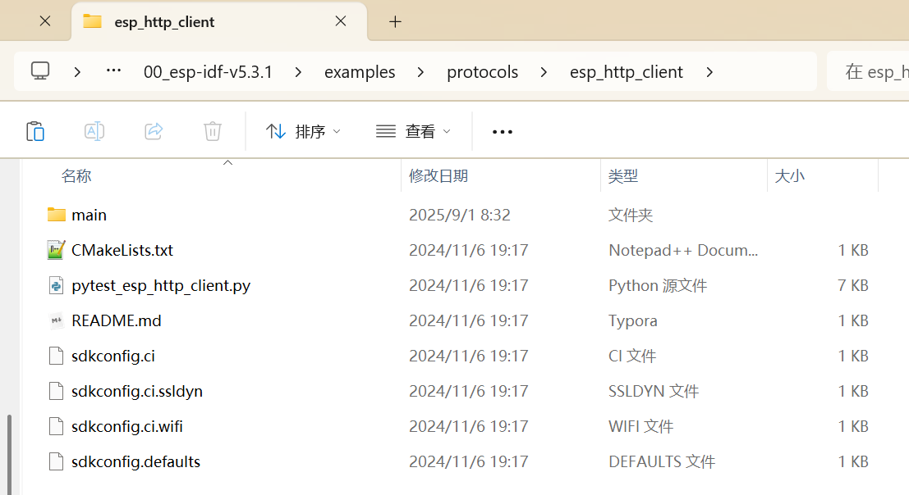

# http请求

## 部分参考:

 [32_Drive/ESP32/http发送post请求 at main · gybpersist/32_Drive](https://github.com/gybpersist/32_Drive/tree/main/ESP32/http发送post请求) 

## 组件:



## Dri_http.c

```c
#include "Dri_http.h"

static const char *TAG = "HTTP_CLIENT";

esp_err_t _http_event_handler(esp_http_client_event_t *evt)
{
    // 把获得的数据放到可变缓冲区里面
    mutable_buffer_t *mutable_buffer = (mutable_buffer_t *)evt->user_data;

    switch (evt->event_id)
    {
    case HTTP_EVENT_ERROR:
        ESP_LOGD(TAG, "HTTP_EVENT_ERROR");
        break;
    case HTTP_EVENT_ON_CONNECTED:
        ESP_LOGD(TAG, "HTTP_EVENT_ON_CONNECTED");
        break;
    case HTTP_EVENT_HEADER_SENT:
        ESP_LOGD(TAG, "HTTP_EVENT_HEADER_SENT");
        break;
    case HTTP_EVENT_ON_HEADER:
        ESP_LOGD(TAG, "HTTP_EVENT_ON_HEADER, key=%s, value=%s", evt->header_key, evt->header_value);
        break;
    case HTTP_EVENT_ON_DATA:
        ESP_LOGD(TAG, "HTTP_EVENT_ON_DATA, len=%d", evt->data_len);
        // 不断接收数据
        Com_MutableBuffer_AddData(mutable_buffer, (char *)evt->data, (size_t)evt->data_len);
        break;
    case HTTP_EVENT_ON_FINISH:
        ESP_LOGD(TAG, "HTTP_EVENT_ON_FINISH");
        // 接收到的数据
        MY_LOGE("receivedata: %s", (char *)Com_MutableBuffer_GetData(mutable_buffer));
        break;
    case HTTP_EVENT_DISCONNECTED:
        ESP_LOGI(TAG, "HTTP_EVENT_DISCONNECTED");

        break;
    case HTTP_EVENT_REDIRECT:
        ESP_LOGD(TAG, "HTTP_EVENT_REDIRECT");
        esp_http_client_set_header(evt->client, "From", "user@example.com");
        esp_http_client_set_header(evt->client, "Accept", "text/html");
        esp_http_client_set_redirection(evt->client);
        break;
    }
    return ESP_OK;
}

/**
 * @brief 设置请求体函数 (cJSON格式)
 *
 * @return char* 请求体(cJSON格式)
 */
static char *Dri_http_Set_Body()
{
    // 创建 cJSON对象
    cJSON *root = cJSON_CreateObject();

    // 创建 application对象
    cJSON *application_obj = cJSON_CreateObject();
    cJSON_AddStringToObject(application_obj, "version", esp_get_idf_version());
    MY_LOGE("elf_sga256: %s",esp_app_get_elf_sha256_str());
    cJSON_AddStringToObject(application_obj, "elf_sha256", esp_app_get_elf_sha256_str());
    cJSON_AddItemToObject(root, "application", application_obj);

    // 创建 board对象
    cJSON *board_obj = cJSON_CreateObject();
    cJSON_AddStringToObject(board_obj, "type", "bread-compact-wifi");
    cJSON_AddStringToObject(board_obj, "name", "bread-compact-wifi");
    cJSON_AddStringToObject(board_obj, "ssid", "Lenovo Y70");
    cJSON_AddNumberToObject(board_obj, "rssi", -55);
    cJSON_AddItemToObject(root, "board", board_obj);

    // 将cjson转为字符串
    char *json_str = cJSON_PrintUnformatted(root);
    cJSON_Delete(root);
    return json_str;
}

/**
 * @brief http客户端初始化
 *
 */
void Dri_http_Init(void)
{
    // 创建 可变缓冲区用于接收响应数据
    mutable_buffer_t *mutable_buffer = Com_MutableBuffer_Creat();

    // http配置信息
    esp_http_client_config_t config = {
        .url = "https://api.tenclass.net/xiaozhi/ota/", // 完整请求 URL
        .event_handler = _http_event_handler,           // 事件回调函数
        .method = HTTP_METHOD_POST,                     // http post请求
        .user_data = mutable_buffer,                    // 传递给回调的用户数据
        .crt_bundle_attach = esp_crt_bundle_attach,     // HTTPS 证书配置
        .timeout_ms = 15000,                            // 超时时间
        .disable_auto_redirect = true,                  // 禁用自动重定向
    };
    // 初始化 HTTP 客户端
    esp_http_client_handle_t client = esp_http_client_init(&config);

    // 添加请求头
    esp_http_client_set_header(client, "Device-Id", Com_Get_MAC());
    esp_http_client_set_header(client, "Client-Id", Com_Get_UUID());
    esp_http_client_set_header(client, "User-Agent", "bread-compact-wifi/1.0.0");
    esp_http_client_set_header(client, "Accept-Language", "zh-CN");
    MY_LOGE("mac: %s,uuid: %s\r\n",Com_Get_MAC(),Com_Get_UUID());

    // 添加请求体
    char *body_json = Dri_http_Set_Body(); // 发送的 JSON 格式数据
    MY_LOGE("body_json: %s", body_json);
    esp_http_client_set_header(client, "Content-Type", "application/json");
    esp_http_client_set_post_field(client, body_json, strlen(body_json));

    // 发送请求 
    esp_http_client_perform(client);

    int status = esp_http_client_get_status_code(client);
    if (status == 200)
    {
        MY_LOGE("http client is OK...\r\n");
    }
    else
    {
        MY_LOGE("http client status is %d...\r\n",status);
    }

    // 释放资源
    free(body_json);
    Com_MutableBuffer_Free(mutable_buffer);
    esp_http_client_cleanup(client);
}
```

## Dri_http.h

```c
#ifndef __DRI_HTTP_H__
#define __DRI_HTTP_H__

#include <string.h>
#include <sys/param.h>
#include <stdlib.h>
#include <ctype.h>
#include "esp_log.h"
#include "nvs_flash.h"
#include "esp_event.h"
#include "esp_netif.h"
#include "esp_tls.h"

#include "esp_crt_bundle.h"

#include "freertos/FreeRTOS.h"
#include "freertos/task.h"
#include "esp_system.h"

#include "esp_http_client.h"
#include "esp_app_desc.h"
#include "esp_chip_info.h"
#include "esp_partition.h"
#include "esp_psram.h"
#include "esp_ota_ops.h"

#include "Com_Util.h"
#include "cJSON.h"

/**
 * @brief http客户端初始化
 * 
 */
void Dri_http_Init(void);

#endif /* __DRI_HTTP_H__ */
```


